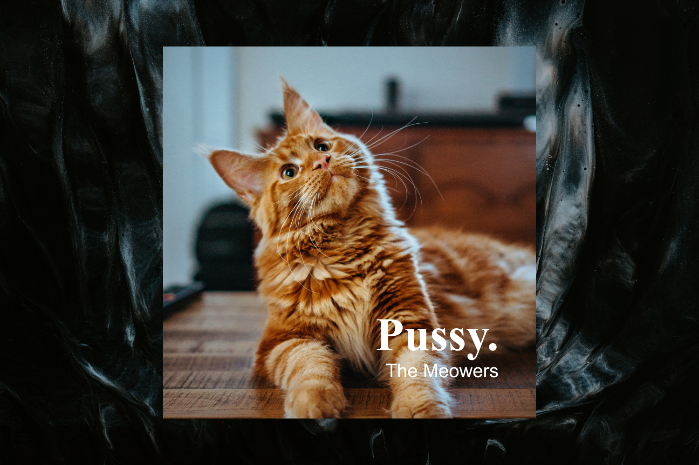

# Album Art Generator

I wanted to make something for making simple album art. Just an image with some text on it. Using Photoshop for making something like this is just too finnicky, in my opinion. To save the album art, simply take a screenshot of it.

To change the settings, right-click the skin and hit "Settings..." as always. In here, you'll find all of the options for changing size, text, font and whatnot.

There's another option called "Open image folder", which takes you to the folder for the images used in the 'generator'. After having put some images there, refresh the skin to make it load them, and scroll up and down on the skin to scroll through the available images.
